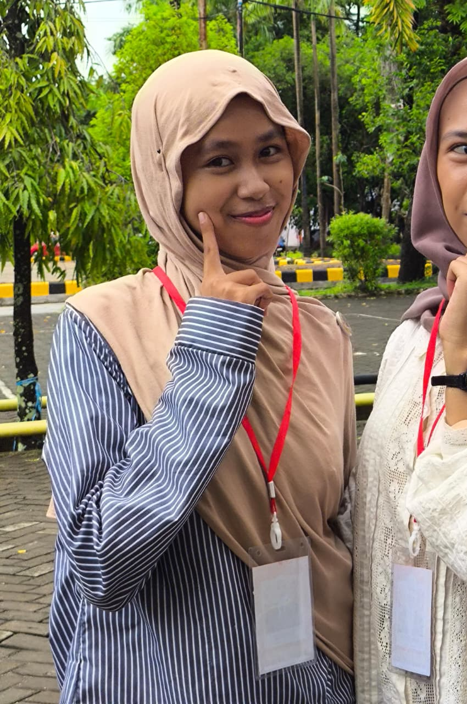
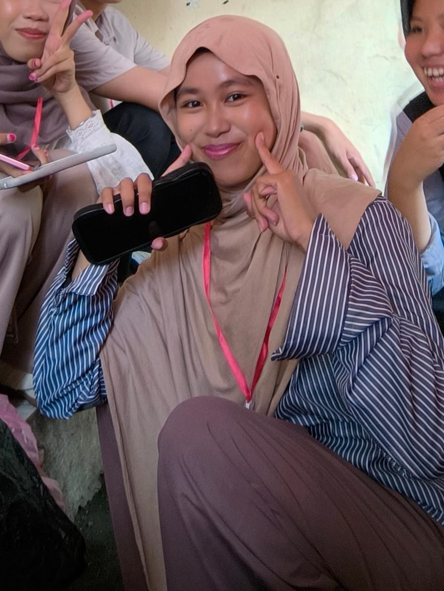

<html lang="en">
<head>
<meta charset="UTF-8">
<title>She Is The Funniest Woman</title>
<meta name="viewport" content="width=device-width, initial-scale=1.0">

<link href="https://fonts.googleapis.com/css2?family=Poppins:wght@300;400;600;700&display=swap" rel="stylesheet">

</head>

<body>

<header>
  

    <h1>She Is The Funniest Woman</h1>
    
Her laugh makes everything feel lighter 💗

  

</header>

<section class="reveal">
  

    
    

      <h2>Her Magic</h2>
      

        She doesn’t force humor — it flows naturally.  
        Her laughter, expressions, and silly moments make people forget their worries.
      

    

  

</section>

<section class="gallery reveal">
  <h2>Funny Moments</h2>
  

    
    
    
    
  

</section>

<section class="reveal">
  

    <h3>“Some people don’t just make you smile —  
    they make life feel warmer.”</h3>
    
— She Is The Funniest Woman

  

</section>

<footer>
  © 2025 | Made with 💗
</footer>

</body>
</html>
